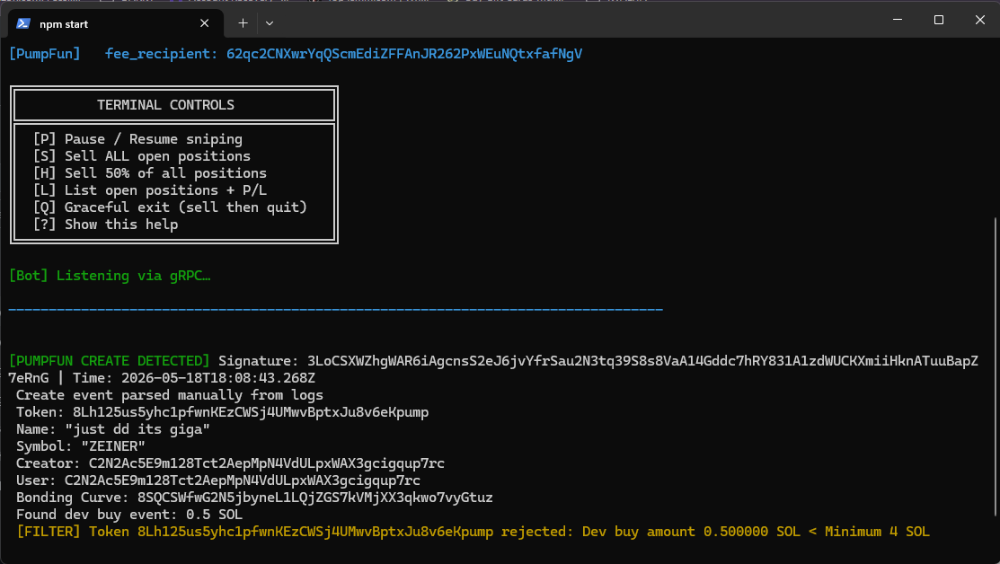
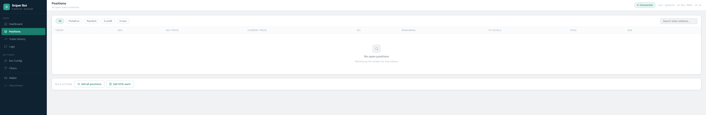
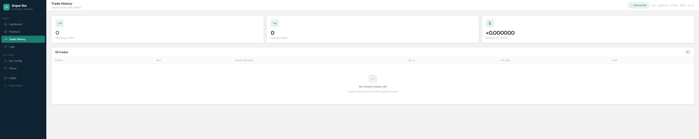
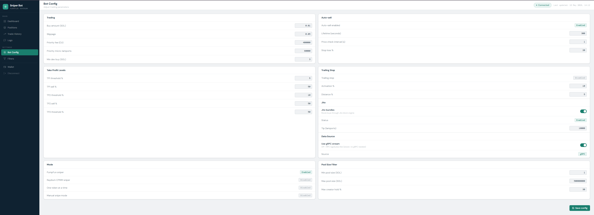
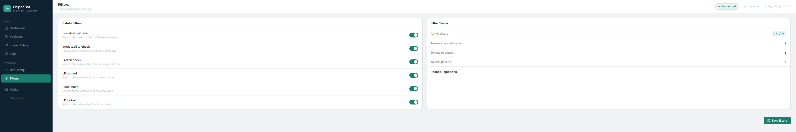
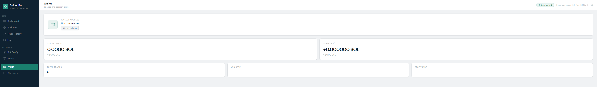

<div align="center">
  <h1>APEX Sniper</h1>
  <h2>Pumpfun Gem/Auto Sniper / WORKS WITH FREE RPC (INCLUDED)</h2>
  
  
  
<p align="center">
  
  </p>

  
  
  [](https://opencollective.com/fakerjs#section-contributors)
  [](https://opencollective.com/fakerjs)
  
</div>



## 🚀 Features








## 📦 Install

  
1. Download nodejs for your PC from nodejs.org -> Read the README

2. Double click CryptoBot.exe for windows users
   
3. If you want to run in terminal
```
Cryptobot.exe
```


## 🔑 License

[MIT]
